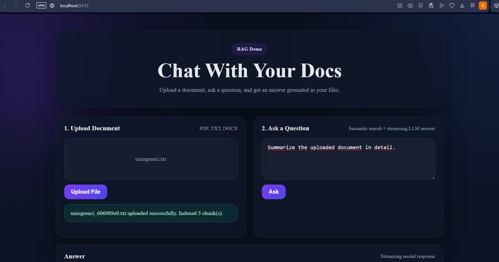
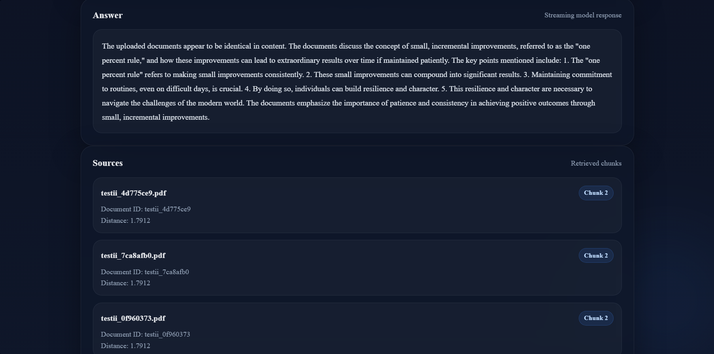

# Chat With Your Docs

A Retrieval-Augmented Generation (RAG) based document question-answering system built with FastAPI, React, ChromaDB, and Groq LLMs.

## Overview

Chat With Your Docs allows users to upload documents and interact with them using natural language questions. The system processes uploaded files, converts them into embeddings, stores them in a vector database, retrieves the most relevant chunks semantically, and generates AI-powered answers grounded in the uploaded content.

The project supports:

* TXT files
* PDF files
* DOC files
* DOCX files

The backend is developed with FastAPI, while the frontend is built using React and Vite.

---

# Features

## Core Features

* Document upload system
* Text extraction from documents
* Text cleaning and preprocessing
* Chunking pipeline
* Embedding generation using Google Gemini Embedding Model
* ChromaDB vector database integration
* Semantic similarity search
* LLM-powered question answering with Groq
* Source retrieval and citation display
* REST API architecture
* React frontend interface

## Bonus Features

* Real-time streaming responses
* Live token-by-token answer generation
* Source display for retrieved chunks
* Modern responsive UI

---

# System Architecture

User Question
      ↓
Embedding Generation
      ↓
Semantic Retrieval (ChromaDB)
      ↓
Relevant Context Chunks
      ↓
Groq LLM
      ↓
Streaming Response
      ↓
Frontend Rendering

---

# Tech Stack

## Backend

* FastAPI
* Python
* ChromaDB
* Groq API
* Google Gemini Embedding API
* Pydantic
* Uvicorn

## Frontend

* React
* Vite
* JavaScript
* CSS

---

# Project Structure

backend/
│
├── app/
│   ├── core/
│   ├── services/
│   ├── utils/
│   └── main.py
│
├── data/
│   ├── uploads/
│   └── chroma_db/
│
└── requirements.txt

frontend/
│
├── src/
│   ├── App.jsx
│   ├── App.css
│   └── main.jsx
│
└── package.json

---

# How It Works

## 1. Document Upload

Users upload TXT, PDF, DOC, or DOCX documents through the frontend interface.

The backend:

* validates file types
* sanitizes filenames
* generates unique filenames
* stores files securely

---

## 2. Text Extraction

The system extracts raw text from uploaded documents.

Different parsers are used depending on the file type.

---

## 3. Text Processing

Extracted text is:

* cleaned
* normalized
* split into smaller chunks

Chunking improves semantic retrieval quality and embedding efficiency.

---

## 4. Embedding Generation

Each chunk is converted into vector embeddings using the Google Gemini Embedding model.

These embeddings represent the semantic meaning of the text.

---

## 5. Vector Database Storage

Generated embeddings are stored in ChromaDB.

Each chunk is saved together with metadata such as:

* filename
* document ID
* chunk index
* content type

---

## 6. Semantic Retrieval

When a user asks a question:

1. The query is embedded
2. ChromaDB performs similarity search
3. The most relevant chunks are retrieved

---

## 7. LLM Answer Generation

Retrieved chunks are sent to the Groq-hosted LLM as context.

The model generates answers grounded only in the uploaded documents.

If the answer cannot be found in the context, the system explicitly informs the user.

---

## 8. Streaming Response

The project supports real-time streaming responses.

Instead of waiting for the full answer, tokens are streamed progressively from the backend to the frontend.

### Streaming Technologies Used

Backend:

* FastAPI StreamingResponse
* Server-Sent Event style streaming
* Groq streaming API

Frontend:

* Fetch API
* ReadableStream
* Incremental UI rendering

---

# API Endpoints

## Health Check

GET /health

---

## Upload Document

POST /upload

Uploads and indexes a document.

---

## Query Documents

POST /query

Returns semantically relevant chunks.

---

## Ask Question

POST /ask

Returns a standard non-streaming answer.

## Streaming Question Answering

POST /ask/stream

Returns real-time streaming responses.

---

# Installation

## Clone the Repository

git clone https://github.com/your-username/chat-with-your-docs.git

---

# Backend Setup

cd backend

Create virtual environment:

python -m venv .venv

Activate virtual environment:

Windows:

.venv\Scripts\activate

Linux/macOS:

source .venv/bin/activate

Install dependencies:

pip install -r requirements.txt

Create a `.env` file:

GOOGLE_API_KEY=your_google_api_key
GROQ_API_KEY=your_groq_api_key
CHROMA_COLLECTION_NAME=documents

Run backend:

python -m uvicorn app.main:app --reload

---

# Frontend Setup

cd frontend

Install dependencies:

npm install

Run frontend:

npm run dev

---

# Example Workflow

1. Upload a document
2. The system extracts and chunks the text
3. Embeddings are generated
4. ChromaDB indexes the chunks
5. Ask a question
6. Relevant chunks are retrieved
7. The LLM generates a grounded response
8. The response streams live to the frontend

---

# Error Handling

The project includes:

* unsupported file type validation
* API exception handling
* safe filename generation
* encoding issue handling
* streaming error handling
* CORS configuration

---

# Future Improvements

Planned future features:

* Docker support
* Deployment pipeline
* User-based document management
* Authentication system
* Multi-user collections
* Chat history
* Markdown rendering
* Advanced UI improvements
* Better real-time streaming UX

---

# Demo Screenshots

## Upload & Question Interface

## Streaming Response & Retrieved Sources

---

# License

This project is developed for educational and portfolio purposes.

---

# Author

Selin Akkaş
